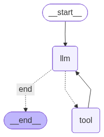
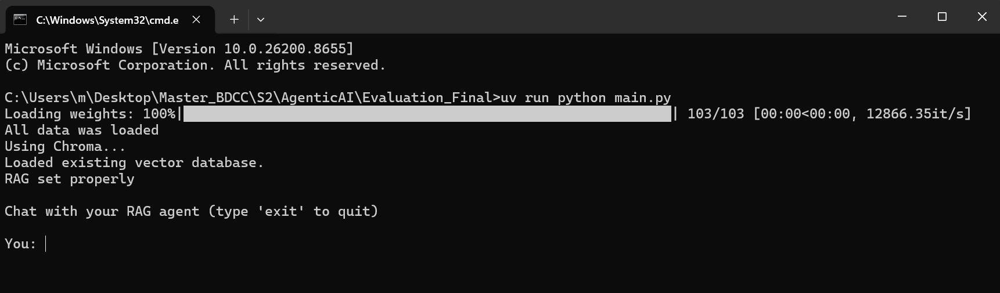

# Final Project - RAG Agent (Sustainability reporting agent)

## Overview
This project implements an Agentic Retrieval-Augmented Generation (RAG) system using LangGraph. 
The system is designed to answer complex questions based on a custom knowledge base in the domain of sustainability. 
It combines document retrieval, reasoning, tool usage, and structured decision-making through a graph-based architecture.

## Objectivs
* Build a custom document knowledge base
* Implement embedding + retrieval pipeline
* Integrate LLM for generation
* Design tools for reasoning and search
* Build an Agentic workflow using LangGraph
* Manage state and memory across steps
* Visualize the graph structure

## Project structure
    Evaluation_final
    |__main.py                           => Run the agent (gives a CLI interface)
    |__config
    |   |__config.py                     => Contains important constants needed (llm model name, embeddings model ....)
    |__Evaluation
    |   |__evaluation.py                 => Runs automatically 10 easy questions and 10 hard questions on our agent and save results in evaluation_results.txt
    |   |__evaluation_results.txt        => Contains the results from the test. Question + Answer + and if the RAG was used
    |__Graph
    |   |__ draw_graph.py                => Draw the schema of our graph
    |   |__graph.png                     => Graph saved as image
    |__src
    |   |__RAG
    |   |   |__loader.py                => Read the files in memory
    |   |   |__splitter.py              => Split the file data into chunks
    |   |   |__embeddings.py            => Generate the embeddings
    |   |   |__vectorStore.py           => Save the embeddings either in memory or chroma_db
    |   |   |__retriever.py             => Create retriever using as_retriever() to search for information
    |   |__tools
    |   |   |__tools.py                 => Contain the tools to be used by our agert
    |   |__model
    |   |   |__systemPrompt.py          => Contain our system prompt
    |   |   |__llm.py                   => Defines the model used OLLAMA in this case
    |   |__graph
    |   |   |__state.py                 => Define the state Class
    |   |   |__nodes.py                 => Define the nodes to be used
    |   |   |__graph.py                 => Creates our agent graph
    |__chroma_db                        => Our embeddinggs are stored here when the user does not want to use memory
    |__resources
    |   |__pdf                          => This file contains the source data used in our RAG
    |__pyproject.toml                   => Contains the libraries used
    |__README.MD                        => Explains the project

## Tech stack
* LLM: `llama3.2:latest`
* Embeddings: HuggingFace `sentence-transformers/all-MiniLM-L6-v2`
* Vectorstore: Two options 
    1. chroma (data saved in chroma_db)
    2. inMemory
    
    Modify `VECTOR_STORE` in [`config.py`](/config/config.py) to "chroma" or "memory"

## Documents
This agent uses files with sustainability data.
In this version, 11 files containing GRI requirements are uploaded

|file                        | Source              |
|----------------------------|---------------------|
|[GRI 1: Foundation 2021](/resources/pdf/GRI%201_%20Foundation%202021.pdf)| GRI|
|[GRI 2: General disclosures 2021](/resources/pdf/GRI%202_%20General%20Disclosures%202021.pdf)| GRI|
|[GRI 3: Material topics 2021](/resources/pdf/GRI%203_%20Material%20Topics%202021.pdf)| GRI|
|[GRI 11: Oil and Gas Sector 2021 v1.1](/resources/pdf/GRI%2011_%20Oil%20and%20Gas%20Sector%202021%20V1.1.pdf)| GRI|
|[GRI 13: Agriculture Aquaculture and Fishing Sector 2022 v1.1](/resources/pdf/GRI%2013_%20Agriculture%20Aquaculture%20and%20Fishing%20Sectors%202022%20V1.1.pdf)| GRI|
|[GRI 101: Biodivesity 2024](/resources/pdf/GRI%20101_%20Biodiversity%202024%20-%20English.pdf)| GRI|
|[GRI 102: Climat Change 2025](/resources/pdf/GRI%20102_%20Climate%20Change%202025.pdf)| GRI|
|[GRI 103: Energy 2025](/resources/pdf/GRI%20103_%20Energy%202025.pdf)| GRI|
|[GRI 302: Energy 2016](/resources/pdf/GRI%20302_%20Energy%202016.pdf)| GRI|
|[GRI 305: Emissions 2016](/resources/pdf/GRI%20305_%20Emissions%202016.pdf)| GRI|
|[GRI 306: Waste 2020](/resources/pdf/GRI%20306_%20Waste%202020.pdf)| GRI|

#### Sources: 
* GRI Docs: https://www.globalreporting.org/how-to-use-the-gri-standards/gri-standards-english-language/

#### Adding new files

Place documents inside `resources` then inside the associated file [`pdf`](/resources/pdf) for pdfs.
**NOTE:** The [`loader.py`](/src/RAG/loader.py) takes into account the file extention. 
The split into pdf, txt or docx is just to keep the files organised

## How to run
    uv run python main.py

**Notes:** 
* The [`main.py`](/main.py) will provide you with an interractive CLI with the Agent
* Make sure your Ollama server is running

## Agent architecture
### Graph

### Tools
* `retrieve` This tool use data from files provided and give you detailed explanation
* `explain_concept` This tools use data from files provvided to explain a specific concept

## Evaluation
To run the evaluation use:
    uv run python Evaluation/evaluation.py

In this evaluation script, our model gets an array of 20 questions as inputs. Then the agent provide the answer for each question.
Then the resulting answers are saved to a text file.

Example of output from the [text file](/Evaluation/evaluation_results.txt):

    ==============================
    Q1: What is ESG?
    Retrieval used: True
    Answer:
    ESG stands for Environmental, Social, and Governance. It refers to the non-financial aspects of a company's performance and impact on its stakeholders.

    Environmental (E) refers to a company's environmental policies, practices, and results related to resource depletion, pollution, climate change, and other environmental issues.

    Social (S) refers to a company's social policies, practices, and results related to labor practices, human rights, community engagement, and other social issues.

    Governance (G) refers to a company's governance policies, practices, and results related to executive compensation, audit committee composition, board diversity, and other governance-related issues.

    ESG considerations are increasingly important for investors, as they can impact a company's long-term financial performance and reputation. Many companies now incorporate ESG factors into their decision-making processes and reporting practices.

    ==============================

## Screenshots
### CLI Interface

### Interraction

## NOTES
* A running OLLAMA server is needed

### Dependencies
    requires-python = >=3.12
    "langchain>=1.3.11
    "langchain-chroma>=1.1.0
    "langchain-community>=0.4.2
    "langchain-huggingface>=1.2.2
    "langchain-ollama>=1.1.0
    "pypdf>=6.14.2
    "sentence-transformers>=5.6.0