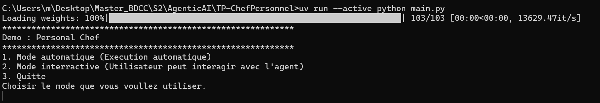
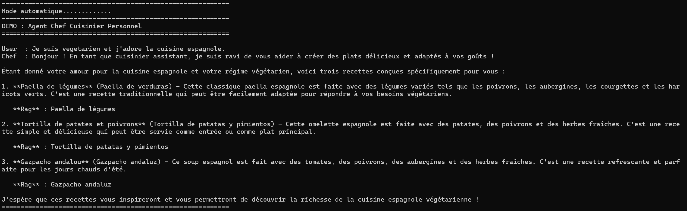
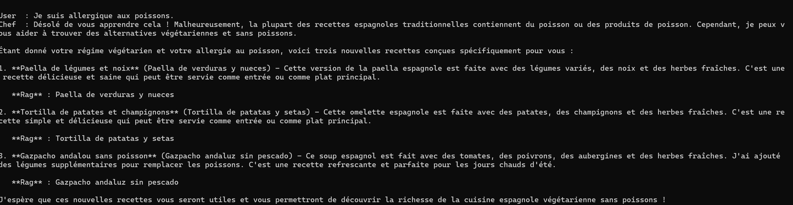
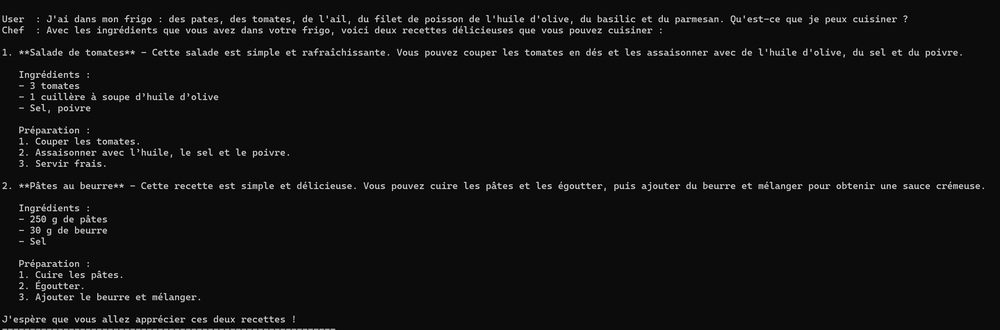
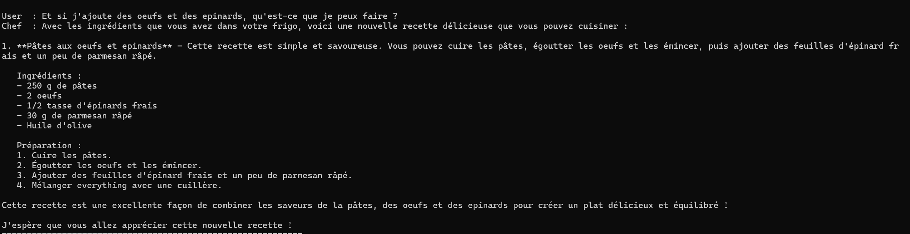
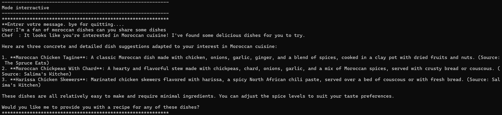
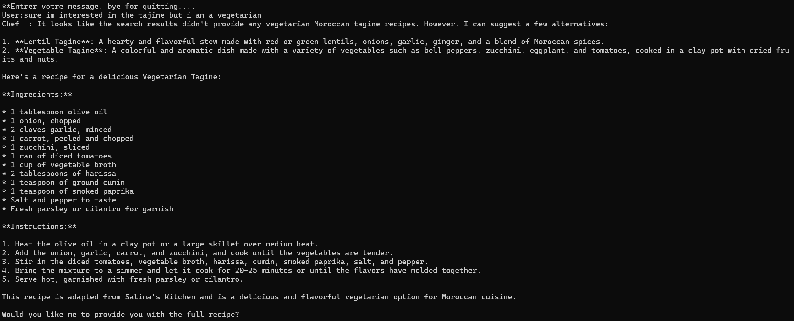
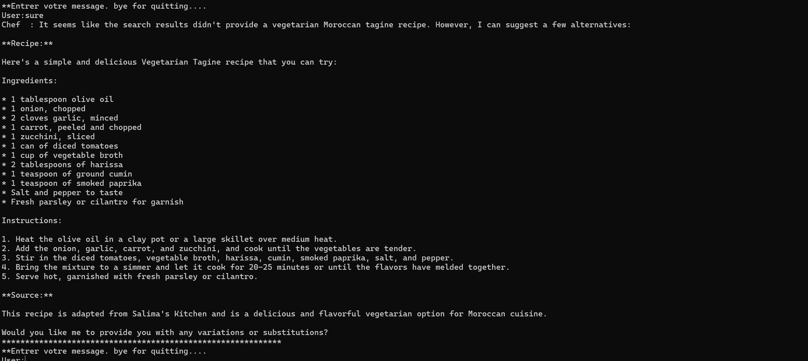

# Project 1: Personal Chef

## Objectifs
The goal of this project is to create a Personal Chef capable of the following:
* Receive a list of available ingredients in the refrigerator
* Remember preferences or information provided by the user (memory)
* Use a web search tool or RAG to supplement culinary knowledge if necessary (recipes,
techniques, ingredient combinations) 
* Suggest one or more dishes adapted to the available ingredients.

## Files
    TP_ChefPersonnel
    |__src
    |   |__ RAG.py          --> Reading the file "receipes.txt" and creating embeding
    |   |__ Tools_Setup.py  --> Defining the tools
    |   |__ Agent.py        --> Contains the implementation of the agent
    |__resources
        |__ receipes.txt    --> Contains the list of 20 receipe with names, ingredients needed and how to prepare them
    |__ main.py             --> Launch the agent

## .env file structure
    HF_TOKEN = --Insert your hugginface API key. NOTE: NOT REQUIRED
    TAVILY_API_KEY = --Insert your TAVILY API key. NOTE: REQUIRED
    MODEL_OLLAMA = llama3.2:latest

## How to run
    uv run --active python main.py

## Architecture
    User --> AgentChef (llama3.2:latest) --> Search_RAG             --> InMemoryVectorStore --> Huggingface embedding (all-MiniLM-L6-v2)
                                         --> Search_Web (Tavily)
                                         --> Store_Preferences      --> ChefState (update)
                                         --> Get_Preferences        --> ChefState (read)

## Agent testing
Users can chose which mode to use:
* Mode 1 execute predefined requests
* Mode 2 allows the user to interact freely with the agent

### Non interractive test

### Interractive test

## Notes
* A `Tavily` API key is required
* An `ollama` server running on the background is needed